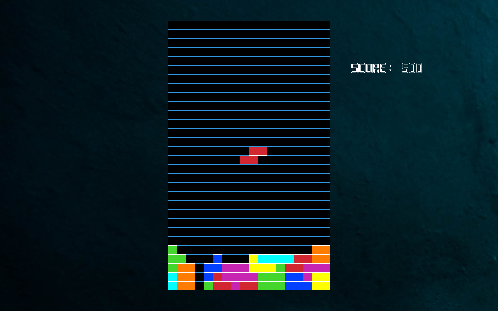

# Tetris
This game was built using JavaFX, Spring Boot, and Apache Maven.

## How to Play
### Setup
A pkg file containing the game can be downloaded by clicking <a href="https://raw.githubusercontent.com/andrewchatch/tetris_game/master/Tetris-1.0.pkg" target="_blank" >here</a> (macOS). 
Windows and Linux-based files will be added soon, but in the meantime, you are more than welcome to clone the repository and run the project locally.

Once the pkg file is downloaded, double-click on it and follow the steps to install the application. After that, voila, you are ready to play Tetris!

### Controls
Use left and right arrow keys to move the current shape horizontally.

Use the up arrow key to rotate the current shape.

Use the down arrow key to move the current shape down faster. Hitting spacebar will immediately drop the shape the rest of the way.

The game will progressively get faster as you play.

